# Lab 01 Report - Introduction to Open Source Software
6.Open Source Definition
  It defines what open source is and makes sure it is fair and free to everyone. 

7.Smart Questions:
  Choose correct forum. Search before asking question. Use project mailing lists to get faster response. 
  Write question clearly. Be modest. "Don't post homework questions".
  
  My suggestions:
    Write down what I have done to debug to help solving the problem.
    Ask as many people as possible.
    
8.chapter 3 of Free Culture
  Jesse Jordan was a RPI student. He modified a search engine built by others by fixing a bug within the Microsoft file-sharing system.
But because of some music files uploaded by users, he faced a lawsuit filed by RIAA. I think Jesse did nothing wrong since he just built the searching engine. He did not upload or ask user to upload music file. RIAA should file those users who uploaded music. To avoid these kind of situations, It is important to think about copyright when doing a project.  
  
13.Screenshot man_tree
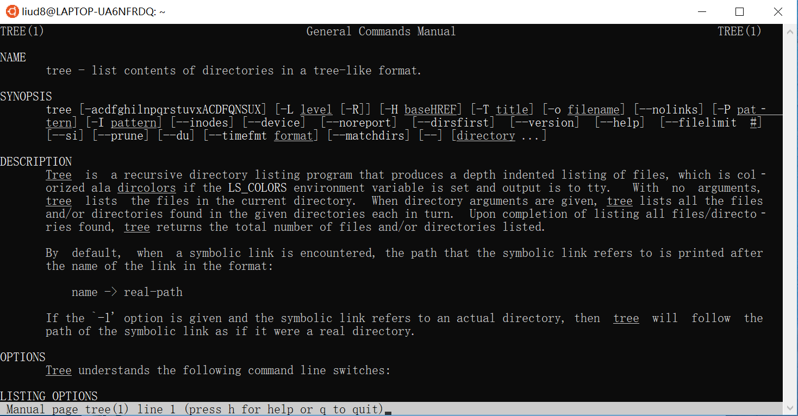

15.Regex
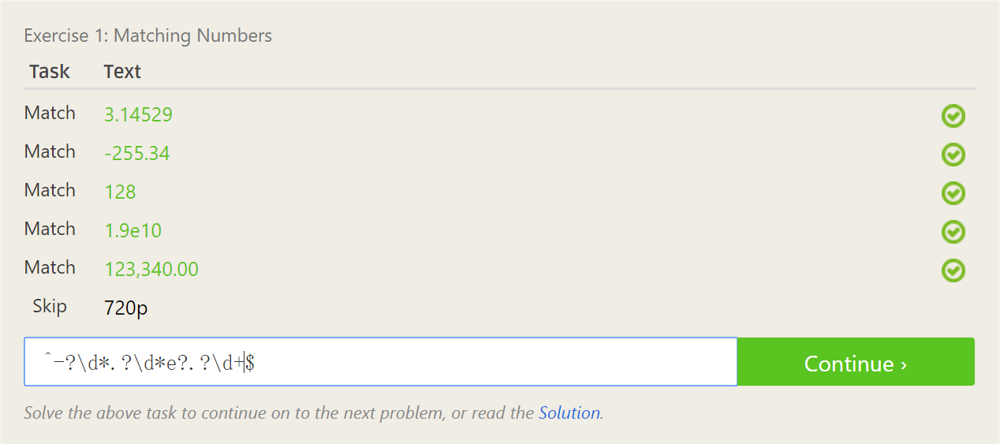
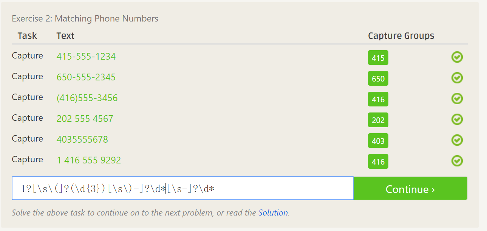
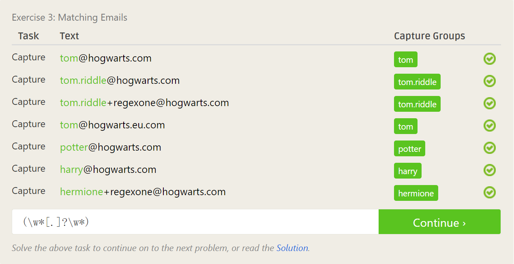
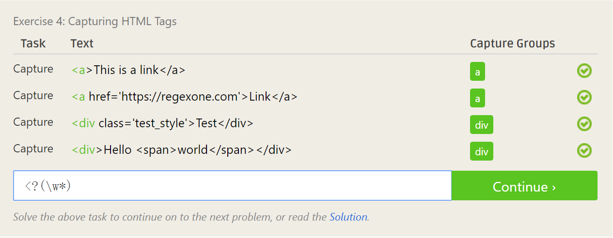
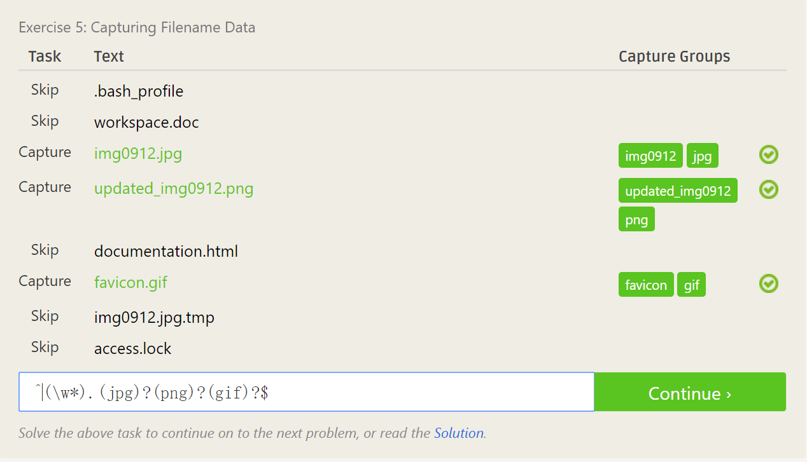
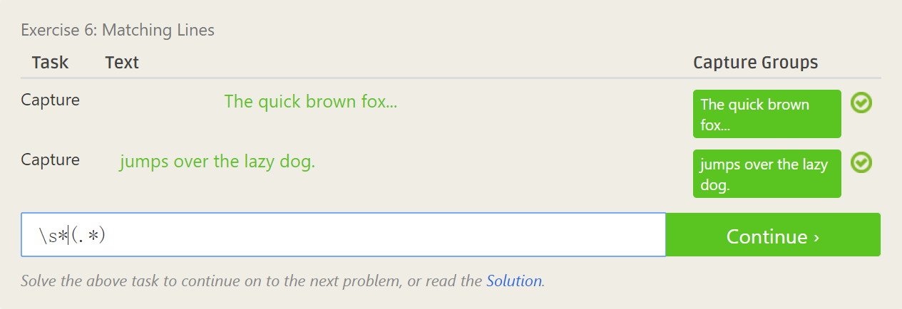
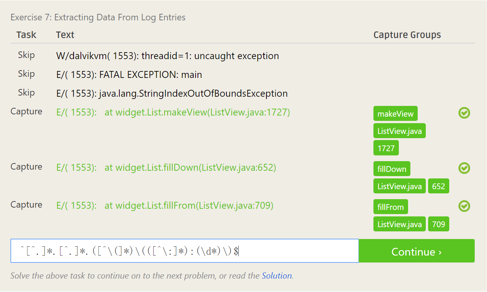

16.Regex
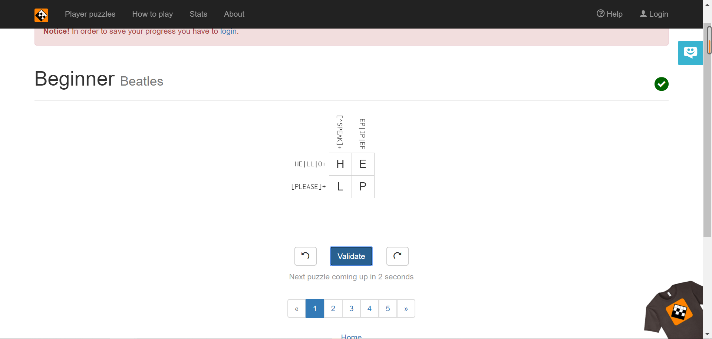
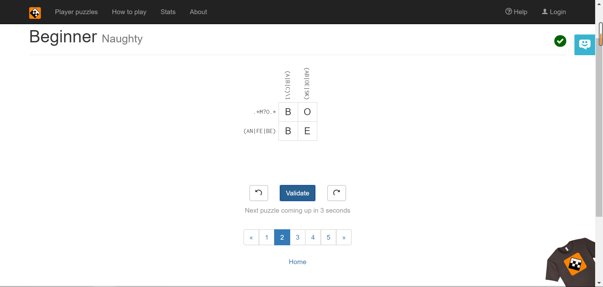
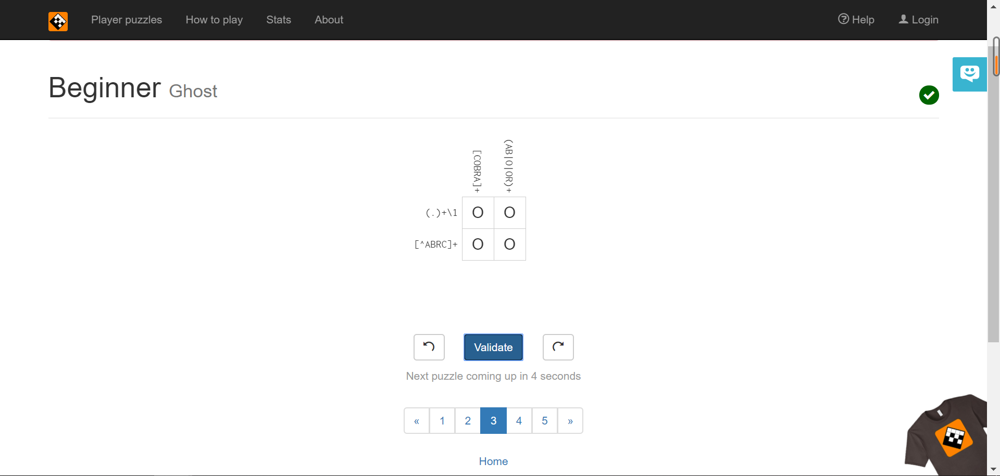
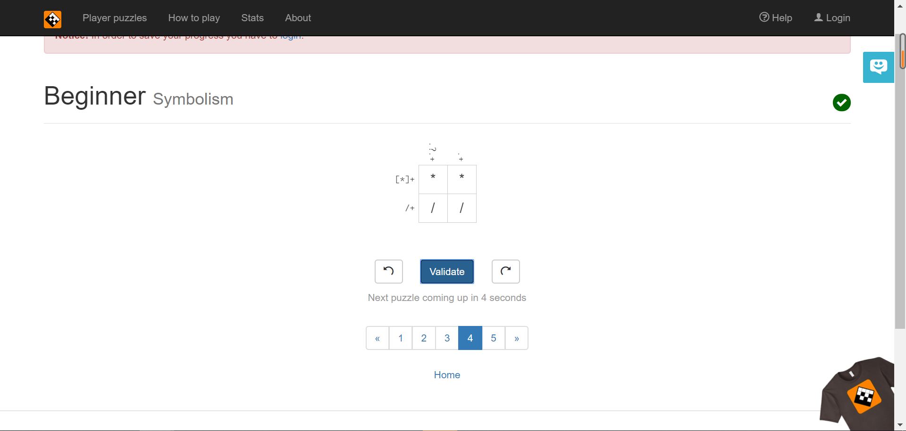
