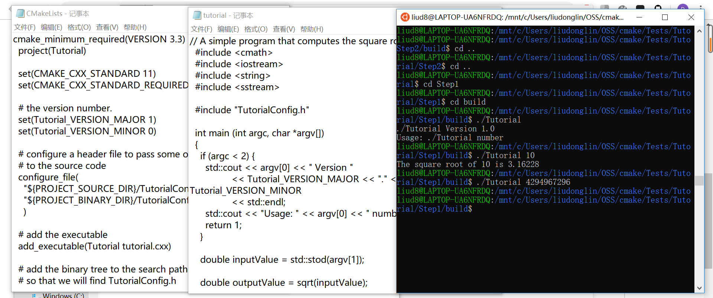
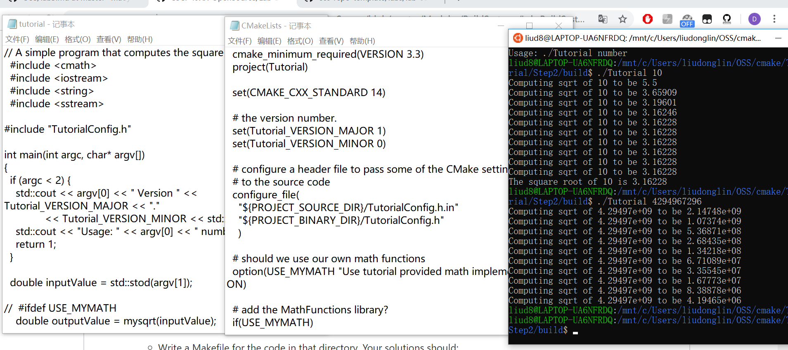
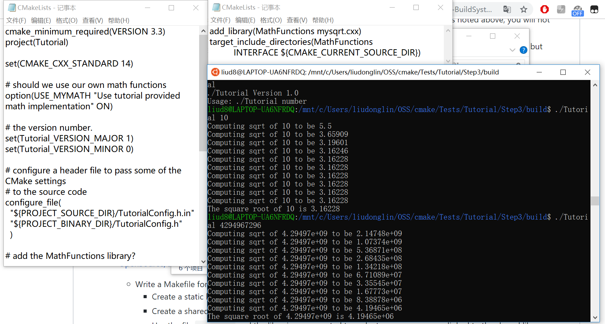
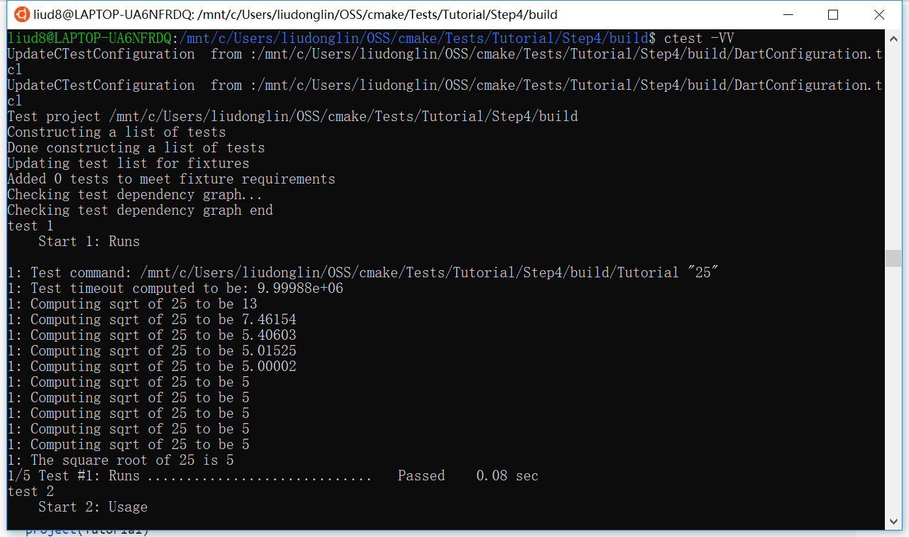
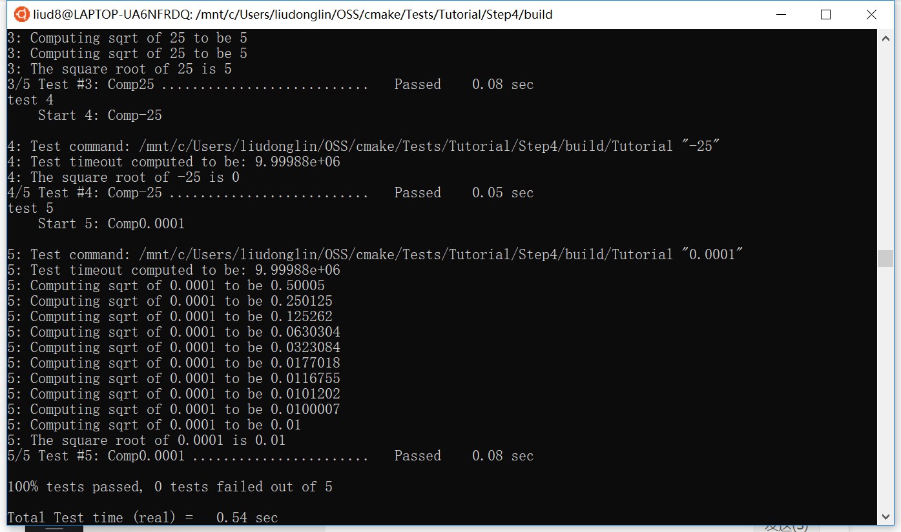
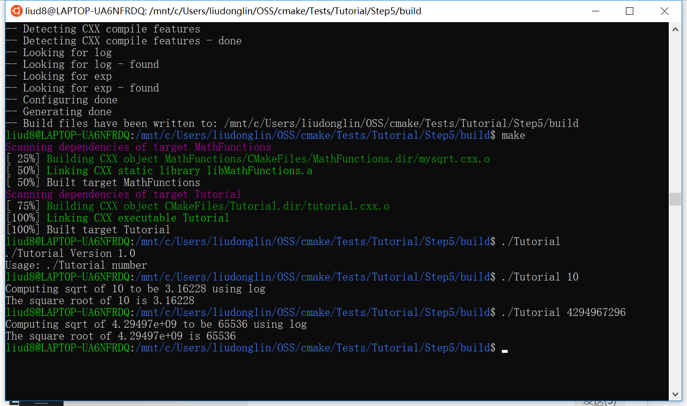

# Step 1
[step1/tutorial.cxx](step1/tutorial.cxx)

[step1/CMakeLists.txt](step1/CMakeLists.txt)

# Step 2
[step2/tutorial.cxx](step2/tutorial.cxx)

[step2/CMakeLists.txt](step2/CMakeLists.txt)

# Step 3
[step3/MathFunctions/CMakeLists.txt](step3/MathFunctions/CMakeLists.txt)

[step3/CMakeLists.txt](step3/CMakeLists.txt)

# Step 4
[step4/MathFunctions/CMakeLists.txt](step4/MathFunctions/CMakeLists.txt)

[step4/CMakeLists.txt](step4/CMakeLists.txt)

# Step 5
[step5/MathFunctions/CMakeLists.txt](step5/MathFunctions/CMakeLists.txt)

[step5/CMakeLists.txt](step5/CMakeLists.txt)

