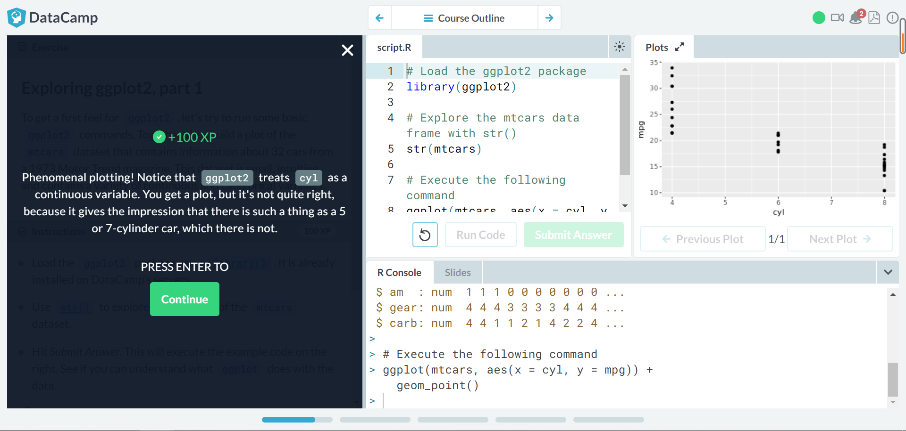

## Data Visualization with ggplot2 (Part 1)

## Multiple and Logistic Regression

## Link to RCOS Observatory
[https://rcos.io/projects/ziyangji/safe-ride-web/profile](https://rcos.io/projects/ziyangji/safe-ride-web/profile)
